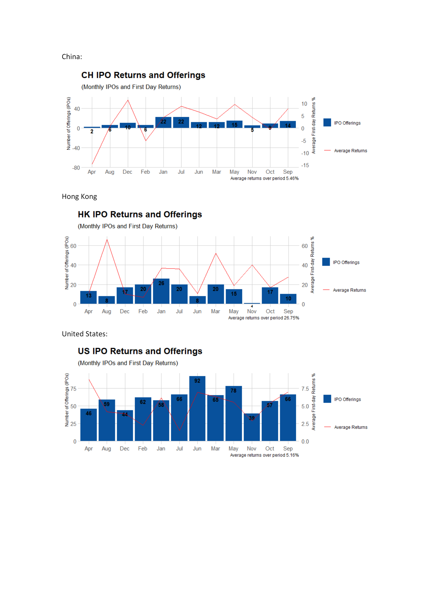
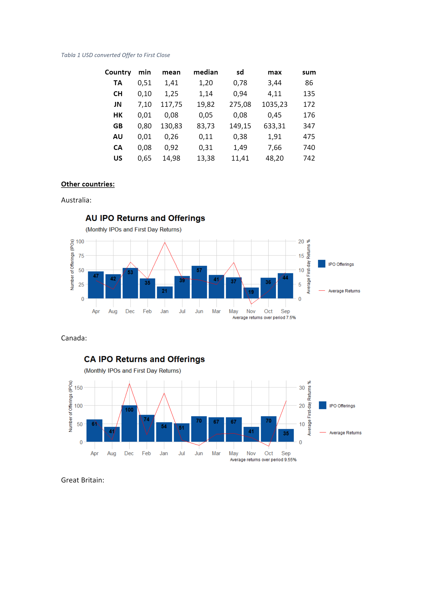
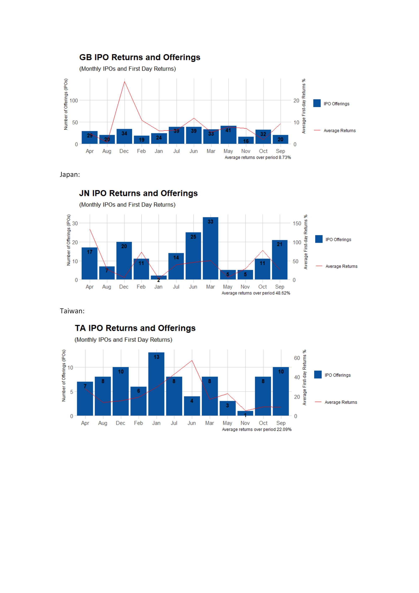

```{r setup, include = FALSE, message = FALSE, warning = FALSE}
knitr::opts_chunk$set(echo = TRUE)
```

I wrote a script a while back when I was working on a project which required the analysis of IPO data, of course I used the IPO data from the bloomberg terminal but I wanted a free source also. Yahoo Finance collects IPO data for a number of worldwide markets, its not clean data but it goes as far back as the year 2000. 

I wanted to follow on from some research by J.R.Ritter [here](https://site.warrington.ufl.edu/ritter/files/2019/08/Monnew.pdf). The goal is to try and compute the *money left on the table* from IPO's and extend the research up until 2018.

**Quote:** *In the 1980s, the average first-day return on initial public offerings (IPOs) was 7%. The average first-day return doubled to almost 15% during 1990-1998, before jumping to 65% during the internet bubble years of 1999-2000 and then reverting to 12% during 2001-2003.*

The code is not clean and if I had to re-write it today I would do so very differently but it works. I just re-download a small sample of the data as it takes some time to process all years but changing `from` to the year 2000 should get you all the data.


```{r IPOs, include = TRUE, message = FALSE, warning = FALSE}
library(rvest)
library(naniar)
library(tidyverse)
library(tidyquant)
library(lubridate)
library(knitr)
library(kableExtra)

from = "2019-09-01"
to = "2019-09-19"

s <- seq(as.Date(from), as.Date(to), "days")
url <- "https://finance.yahoo.com/calendar/ipo?from="
links <- gsub(" ", "", paste(url,from,"&to=",to,"&day=",format(s, "%Y-%m-%d")))

store <- NULL
tbl <- NULL

for(i in links){
  store[[i]] = read_html(i)
  tbl[[i]] = html_table(store[[i]])
}


list <- unlist(tbl, recursive = FALSE)
df <- do.call("rbind", list)
df <- df %>%
  replace_with_na_all(condition = ~.x == "-")

data <- df[!is.na(df$Price), ]
```

I get a nice data frame which looks like:

```{r, include = TRUE, message = FALSE, warning = FALSE}

data %>%
  head() %>%
  kable() %>%
  kable_styling(bootstrap_options = c("striped", "hover", "condensed", "responsive"))

```

Theres lot of missing IPO price data and many duplicate results since this is just a calendar and thus reports on any news about an IPO.

I next get the stock price information: - which can take some time so I suggest saving the results.

```{r, include = TRUE, message = FALSE, warning = FALSE}
symbols <- df$Symbol
symbols <- symbols[symbols != ""] 

stocks <- symbols %>%
  tq_get("stock.prices",
         from = from,
         to = to)

stocks %>%
  head() %>%
  kable() %>%
  kable_styling(bootstrap_options = c("striped", "hover", "condensed", "responsive"))
```


Next I join the daily stock price data with the IPO data, clean it up a little and compute the returns. I also split the data into different markets such as NYSE, LSE, Frankfurt etc. and compute the average daily returns. You can find everything along with the [excel](https://github.com/msmith01/IPO_Web_Scraping_Yahoo/blob/master/yahoo_finance_IPOs_2000_2018.csv) file collecting IPOs since 2000 [here](https://github.com/msmith01/IPO_Web_Scraping_Yahoo).

Heres how the final data looks with the calculated one day price returns:

```{r, include = TRUE, message = FALSE, warning = FALSE}
read.csv("https://raw.githubusercontent.com/msmith01/IPO_Web_Scraping_Yahoo/master/yahoo_finance_IPOs_2000_2018.csv", nrows = 10) %>%
  kable() %>%
  kable_styling(bootstrap_options = c("striped", "hover", "condensed", "responsive"))
  
```

I try to recreate some of the plots on J.R.Ritters website for each of the countries.


```{r, include = TRUE, message = FALSE, warning = FALSE}



```

See J.R.Ritter for other [IPO data.](https://site.warrington.ufl.edu/ritter/ipo-data/)
See Tim Loughran and Jay Ritter [IPO returns:](https://site.warrington.ufl.edu/ritter/files/2016/06/why-has-IPO-Underpricing-Increased-Over-Time.pdf)


